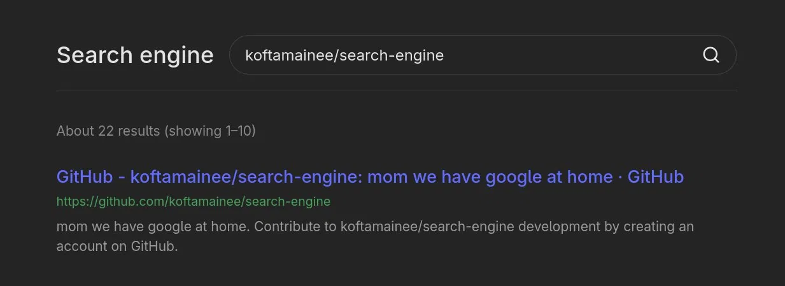
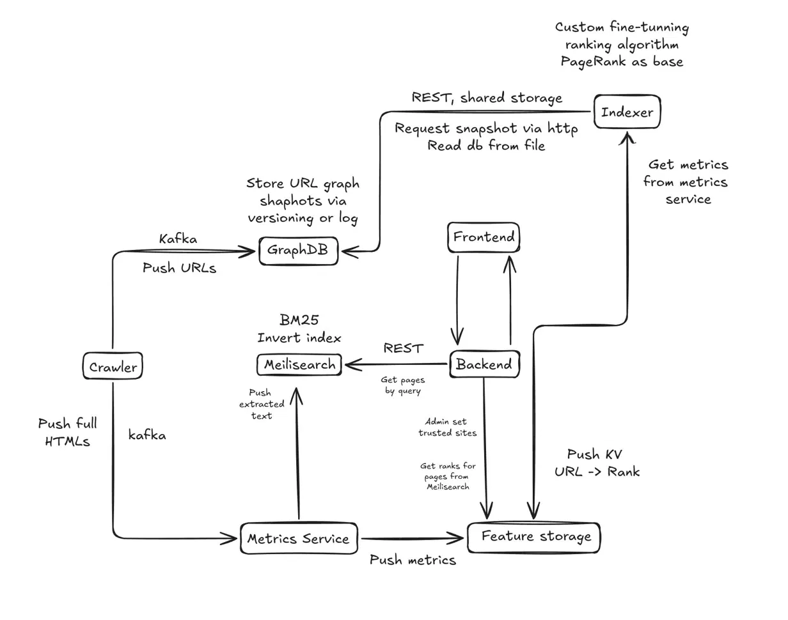

# 🏠 search-engine

[](LICENSE)



> mom we have google at home

**search-engine** is a self-hosted web search engine built from scratch: a custom crawler, a BM25-based full-text index, a link-graph store for PageRank-style authority signals, and a web UI to tie it all together — all running as a fleet of small, independently deployable services.

It crawls the web (respecting `robots.txt`), extracts and normalizes page text, indexes it for fast full-text search, and (eventually) re-ranks results using a custom scoring model trained on link-graph and traffic features — PageRank as the baseline, with room to grow.

---

## ✨ Why this project?

- **From-scratch crawler** — concurrent worker pool, `robots.txt` caching in Redis, URL normalization and deduplication, BFS-style frontier via a Redis queue
- **Real full-text search** — BM25 ranking via Meilisearch over crawled page text, titles, and descriptions
- **Pluggable ranking** — link graph stored in Neo4j (Graph Data Science plugin) as the base for PageRank, with a feature store to mix in custom signals
- **Microservices, not a monolith** — Go backend/crawler/indexer, Rust metrics service, Nuxt frontend, each with their own datastore and health checks
- **One-command deploy** — `docker compose up`, everything wired together with healthchecks and sane defaults

---

## 🧱 Architecture



> `GraphDB` and `Indexer` (graphdb-indexer + metrics-service ranking loop) are **architecturally planned but not yet implemented** — see [Roadmap](#-roadmap).
---

## 📦 Services

| Service             | Language        | Status      | Description |
|---------------------|-----------------|-------------|-------------|
| `backend`           | Go               | ✅ Working  | REST API: auth, session management, search proxy, suggestions, bookmarks & search history |
| `frontend`          | Nuxt / Vue / TS  | ✅ Working  | Google-style search UI, auth pages, account page |
| `crawler`           | Go               | ✅ Working  | Concurrent crawler with `robots.txt` support, pushes extracted text to Meilisearch |
| `meilisearch`       | —                | ✅ Working  | BM25 full-text index over crawled pages |
| `postgres`          | —                | ✅ Working  | Users, search history, bookmarks |
| `session-storage`   | Redis            | ✅ Working  | User sessions |
| `crawler-state`     | Redis            | ✅ Working  | Crawl frontier, visited set, `robots.txt` cache |
| `feature-storage`   | Redis            | 🚧 Planned  | Ranking features, `URL -> Rank` map, trusted-sites list |
| `message-broker`    | NATS (JetStream) | 🚧 Planned  | Event bus between crawler, metrics-service and graphdb-indexer |
| `graphdb`           | Neo4j + GDS      | 🚧 Planned  | Link graph snapshots, base for PageRank |
| `graphdb-indexer`   | Go               | 🚧 Planned  | Computes PageRank over the link graph, mixes in metrics, writes ranks to feature storage |
| `metrics-service`   | Rust             | 🚧 Planned  | Consumes crawled HTML, extracts page-quality metrics, pushes them to feature storage |

---

## 🚀 Quick start

Requires Docker and Docker Compose.

```bash
git clone https://github.com/koftamainee/search-engine.git
cd search-engine

cp .env_example .env
# edit .env and fill in real secrets (DB passwords, MEILI_MASTER_KEY, etc.)

docker compose up -d
```

By default:

- Frontend: `http://localhost:${FRONTEND_TARGET_PORT}`
- Backend API: `http://localhost:${BACKEND_TARGET_PORT}/v1`
- Meilisearch: internal only (proxied through the backend)

For local development with (Dev API Gateway, Nuxt dev server), use:

```bash
docker compose -f docker-compose.yaml -f docker-compose.dev.yaml up --build
```

---

## 🔍 How crawling works

1. A seed URL is pushed onto a Redis-backed queue (`crawler-state`).
2. A pool of workers (`CRAWLER_NUM_WORKERS`) pop URLs, check `robots.txt` (cached for 96h), and fetch the page.
3. The HTML is tokenized: title, meta description (or `og:description`), and visible text are extracted and normalized (lowercased, whitespace-collapsed, capped at 5000 chars).
4. Outgoing links are resolved to absolute URLs, normalized (scheme forced to `https`, `www.` stripped, trailing slash removed) and filtered against a blocklist of non-content URLs (Wikipedia edit/history/special pages, etc.).
5. New links go back onto the queue; the page itself is indexed into Meilisearch (`web_pages` index) with `id` (MD5 of the URL), `url`, `title`, `description`, `text`, and `timestamp`.

The crawler exposes a small management API:

| Endpoint  | Method | Description |
|-----------|--------|-------------|
| `/health` | GET    | Health check |
| `/status` | GET    | Whether a crawl is currently running |
| `/start`  | POST   | Start crawling from `?url=` |
| `/stop`   | POST   | Stop the running crawl |

---

## 🛠️ Backend API (v1)

| Endpoint         | Method | Auth | Description |
|------------------|--------|----|-------------|
| `/v1/health`     | GET    | —  | Health check |
| `/v1/register`   | POST   | —  | Create a new user |
| `/v1/login`      | POST   | —  | Log in, returns a session token |
| `/v1/logout`     | POST   | ✅  | Invalidate the current session |
| `/v1/me`         | GET    | ✅  | Current user profile |
| `/v1/search`     | GET    | ✅   | Full-text search over indexed pages (`query`, `num`, `offset`) |
| `/v1/suggest`    | GET    | ✅   | Search-as-you-type suggestions |

Search results returned by `/v1/search` look like:

```json
{
  "query": "mantle engine",
  "hits": [
    { "id": "...", "url": "...", "title": "...", "description": "..." }
  ],
  "total": 42,
  "num": 10,
  "offset": 0
}
```

---

## 🗺️ Roadmap

- [ ] **`metrics-service`** (Rust) — consume full HTML from the crawler via NATS, compute page-quality metrics (load time, content density, etc.), push to `feature-storage`
- [ ] **`graphdb-indexer`** (Go) — build and snapshot the link graph in Neo4j from crawler URL events, run PageRank via Graph Data Science, combine it with metrics into a final `URL -> Rank` map
- [ ] Use the computed ranks in `/v1/search` to re-order Meilisearch's BM25 results
- [ ] Admin endpoint for marking trusted sites, used as a ranking signal
- [ ] `mint`-style snapshot/versioning for graph exports between `graphdb` and `graphdb-indexer`

---

## 🤝 Contributing

Pull requests are welcome!

## 📄 License

Apache 2.0 — check [LICENSE](LICENSE) file.